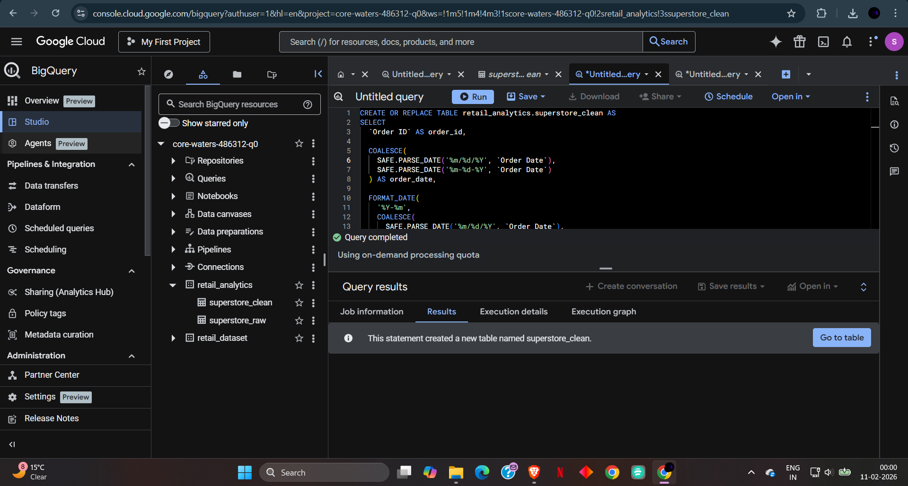

# 📊 Retail Sales & Profitability Insights Dashboard

## 📌 Project Overview
Designed and developed an executive-level retail analytics dashboard to analyze sales performance, profitability, and business trends across regions, customer segments, and product categories. The project demonstrates an end-to-end analytics workflow, starting from raw transactional data, transforming it using Google BigQuery SQL, and delivering actionable insights through a Power BI dashboard designed for business stakeholders.

## 🛠️ Tech Stack
* **Data Warehouse:** Google BigQuery (SQL-based data transformation)
* **Query Language:** SQL (Data cleaning & business metrics)
* **Visualization Tool:** Microsoft Power BI
* **Data Validation:** Microsoft Excel
* **Concepts:** Data Cleaning, Business Metrics, KPI Design, BI Reporting

## 🚀 Key Features
* **Clean Data Layer:** Created an analytics-ready table in BigQuery by handling inconsistent date formats and applying data quality filters.
* **Business Metrics:** Calculated core KPIs such as Total Sales (2.30M), Total Profit (0.29M), Total Orders (9.99K), and Profit Margin.
* **Trend Analysis:** Built interactive Monthly and Year-over-Year (YoY) time-series comparisons for sales and profit tracking.
* **Performance Breakdown:** Enabled granular analysis across regional geography, customer segments, and product hierarchies (Category/SubCategory).
* **Executive Design:** Designed a clean, minimal, single-page Power BI dashboard utilizing custom visual formatting and clear data hierarchies.

## 📸 Project Screenshots

### 1. Executive Power BI Dashboard
*One-page executive dashboard highlighting KPIs, YoY trends, and regional profitability insights.*


### 2. BigQuery Data Transformation (SQL)
*SQL logic used to clean, standardize, and transform raw retail data into an analytics-ready table.*


## 💻 How to View the Project

1.  **Clone the repo:**
    ```bash
    git clone [https://github.com/YOUR-USERNAME/retail-sales-profitability-dashboard.git](https://github.com/YOUR-USERNAME/retail-sales-profitability-dashboard.git)
    ```
2.  **Review the Data Pipeline:**
    Navigate to the `sql_scripts` folder and open `bigquery_transformation.sql` to view the ETL logic used to clean the raw dataset.
3.  **Open the Dashboard:**
    Download and open `Retail_Analytics.pbix` using **Power BI Desktop** to interact with the visualizations and cross-filtering features.
